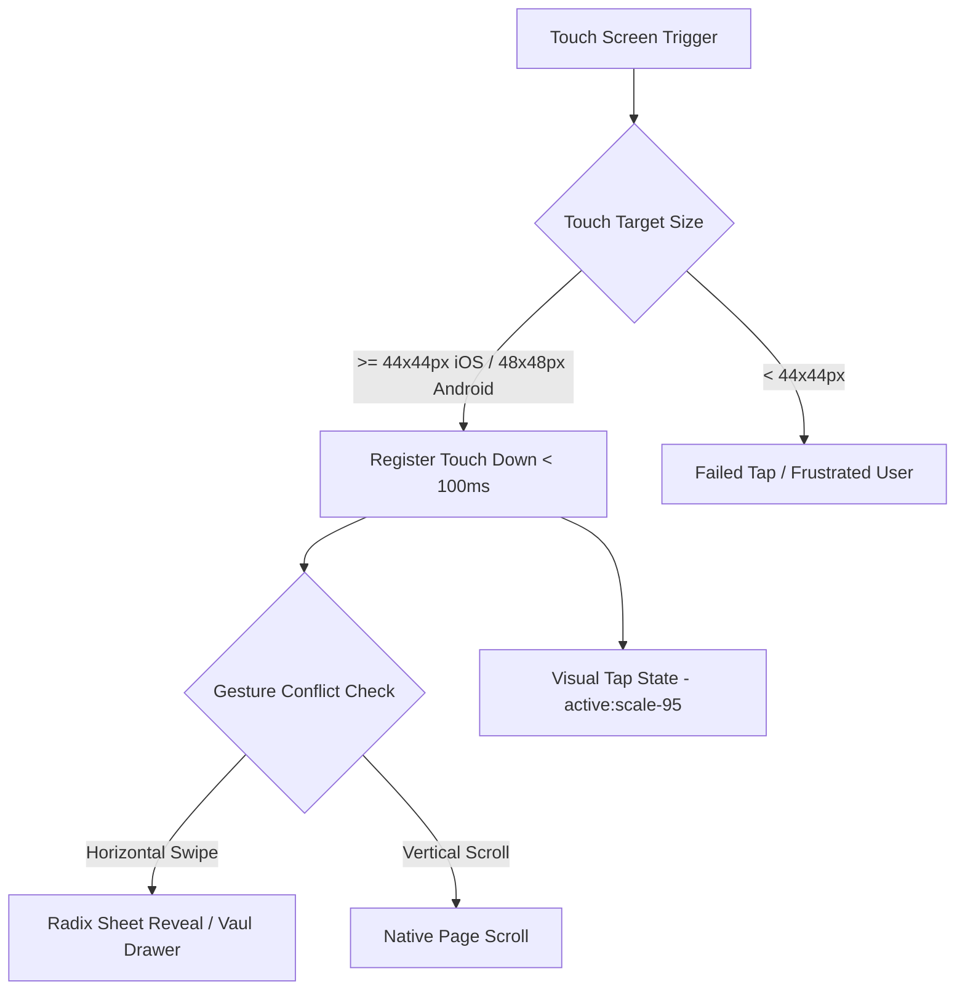

# MSREG Hub — Mobile Design System & Implementation Guide
*Apple-Level Design Aesthetics & Modern Mobile UX for Real Estate Professionals*

This document serves as the official mobile design system, UX framework, and frontend implementation guide for the **MSREG Hub** web application and progressive web app (PWA). It provides developer guidelines and UX guidelines for creating mobile experiences that feel as fluid, polished, and intuitive as native Apple iOS apps, customized for the real estate agency context.

---

## 1. Mobile Color System & Typography Scale

### 1.1 Mobile Color Tokens (Navy + Warm Copper)
The MSREG Hub color system is defined using OKLCH coordinates in [src/styles.css](file:///Users/tyler/Desktop/calendar-hub-craft-main/src/styles.css). It optimizes for outdoor readability (e.g., agents viewing listings on-site) and premium, high-contrast dark-mode presentation.

| Token | CSS Variable / OKLCH Value | Visual Description | Usage / Hierarchy |
| :--- | :--- | :--- | :--- |
| **Deep Navy (Background)** | `var(--background)` / `oklch(0.20 0.02 260)` | Deep slate-navy | Primary canvas, sidebars, page backdrop. |
| **Midnight Slate (Card)** | `var(--card)` / `oklch(0.23 0.02 260)` | Slightly lighter navy | Card container backdrops, dialog content backdrops. |
| **Warm Copper (Primary)** | `var(--primary)` / `oklch(0.55 0.15 40)` | Rich, metallic copper | Brand accent, active states, key CTAs, buttons. |
| **Champagne (Foreground)** | `var(--foreground)` / `oklch(0.97 0.01 90)` | Warm off-white | High-readability titles, body text, primary icons. |
| **Muted Slate** | `var(--muted-foreground)` / `oklch(0.70 0.02 260)` | Mid-tone neutral grey | Secondary info, captions, borders, subheadings. |
| **Sage Green (Approved)** | `var(--status-approved)` / `oklch(0.70 0.16 150)` | Muted sage green | Success states, active listings, approved requests. |
| **Warm Amber (Review)** | `var(--status-review)` / `oklch(0.72 0.15 70)` | Gold-orange | Pending review, coming soon properties. |
| **Crimson (Destructive)** | `var(--destructive)` / `oklch(0.60 0.20 25)` | Rich reddish-crimson | Destructive alerts, delete buttons, critical errors. |

#### Color Accessibility & High Contrast Rules
* **Contrast Compliance**: In dark mode, all text-to-background combinations must meet the **WCAG AA standard (4.5:1 ratio)**. Use `var(--foreground)` (Champagne) on `var(--background)` (Deep Navy) for a contrast ratio exceeding **12:1**.
* **Color Independence**: Never rely on color alone to convey state. Use status icons (e.g., Check, AlertCircle) and typography alongside colors for critical statuses (e.g., in status badges).
* **Interactive Borders**: Use a `border` of `oklch(0.30 0.02 260)` to establish clean containment for inputs and card groupings.

---

### 1.2 Mobile Typography Scale
MSREG Hub utilizes three custom typefaces loaded from Google Fonts:
* **Sans Font**: **Outfit** — Sleek, geometric, high-readability sans-serif for UI, numbers, and body copy.
* **Serif Font**: **Fraunces** — Editorial, premium serif for hero titles, listing headlines, and brand messages.
* **Mono Font**: **JetBrains Mono** — Highly legible monospace font for numbers, dates, and ID codes.

```
       Font Size (rem/px)     Line Height     Weight Constraints & Usage
Title  │  2.25rem / 36px  │     1.15      │  Semibold (600) — Listing Details Hero
H1     │  1.75rem / 28px  │     1.20      │  Semibold (600) — Main Page Titles
H2     │  1.25rem / 20px  │     1.25      │  Medium (500) — Section Subheaders
Body   │  1.00rem / 16px  │     1.50      │  Regular (400) — Forms, Body copy (Auto-zoom safe!)
Muted  │  0.875rem / 14px │     1.40      │  Regular (400) / Medium (500) — Captions, Tabs
Tiny   │  0.75rem / 12px  │     1.30      │  Medium (500) — Status Badges, Small Metadata
```

> [!IMPORTANT]
> **iOS Zoom Prevention**: The minimum font-size for form input elements must be exactly **16px (1.00rem)**. Any size below 16px triggers automatic browser viewport zooming on iOS Safari when focusing an input field, which breaks layout and hampers mobile usability.

#### Mobile Reading & Eye-Tracking Layouts
* **F-Pattern Layouts (Content-heavy)**: Use left-aligned hierarchy for educational posts and lists in the **Agent Toolbox**. Start lines with strong nouns or action icons.
* **Z-Pattern Layouts (Interactive pages)**: Use for dashboards, calendars, and calculators. Lead the user's eye from top-left (back button/brand logo) to top-right (profile/edit actions) and down to the primary bottom CTA (Z-path endpoint).

---

## 2. Touch Interface & Gesture Guidelines

Designing web interfaces that emulate native Apple touch dynamics requires bridging CSS/JS interactions to touch hardware.



### 2.1 Touch Target Sizing
* **Interactive Elements**: Every button, input, toggle, tab, and link must have a minimum interactive touch target area of **$44\times44\text{px}$** (iOS Safari guidance) or **$48\times48\text{px}$** (Android Google guidelines).
* **Paddings and Margins**: If the visual size is smaller (e.g., a $24\times24\text{px}$ close icon), expand the target area using transparent padding (`p-3`) or pseudo-elements (`after:absolute after:inset-[-12px]`).
* **Interactive Spacing**: Maintain a minimum margin of **$8\text{px}$** between interactive elements to prevent accidental mis-taps.

### 2.2 Thumb Reach Zones & Ergonomic Hierarchy
* **Primary Interactive Zone**: Place navigation controls and primary actions (e.g., "Add Listing", "Calculate Proceeds", "Request Booking") in the bottom **50% of the viewport** (the easy thumb reach zone).
* **Safe Top-Header Zone**: Dedicate the top 15% of the screen to static titles, secondary icons (e.g., search, info tooltips), and back actions.
* **Destructive Zone**: Place destructive actions (like "Delete listing" or "Sign out") outside the primary thumb swipe zone to avoid accidental activation, requiring a two-step confirmation (modal sheet).

### 2.3 Visual Touch Feedback Rules
All interactive elements must respond to touch inputs in **under 100ms** to avoid the feeling of latency:
* **Immediate Active Styles**: Use Tailwind's `active:scale-[0.98] active:brightness-90 transition-all duration-100` class patterns.
* **Disable Hover States on Mobile**: Prevent "sticky hover" behavior (where touch devices retain desktop `:hover` styles after release) by wrapping hover utilities in the hover media query: `@media (hover: hover) { .btn:hover { background: ... } }` or Tailwind's `hover:`.
* **Selection Prevention**: Apply `user-select: none; -webkit-user-select: none;` on custom navigation items, icons, and buttons to prevent text highlights during scrolling or rapid tapping.

### 2.4 Gesture Conflicts & Standalone Navigation
* **Swipe-to-Reveal**: Secondary actions (e.g., Swipe to delete a calendar block) must use a horizontal gesture width threshold. Prevent standard page scrolling when swiping horizontally by using CSS `touch-action: pan-y` on the container.
* **Bottom Sheet Interception**: Swiping down on a Radix/Vaul bottom sheet must close the sheet. Do not overlay scrollable content inside sheets unless the user has scrolled to the top of the container (`scrollTop === 0`).

---

## 3. Mobile-Optimized Component Library (React + Tailwind v4)

Our components utilize Radix UI primitives styled with Tailwind CSS v4 custom theme classes in [src/styles.css](file:///Users/tyler/Desktop/calendar-hub-craft-main/styles.css) and shadcn UI templates.

### 3.1 Button States
Apple-level buttons feel tactile, responsive, and clear.

```tsx
// src/components/ui/mobile-button.tsx
import * as React from "react";
import { Slot } from "@radix-ui/react-slot";
import { cva, type VariantProps } from "class-variance-authority";
import { cn } from "@/lib/utils";

const buttonVariants = cva(
  "inline-flex items-center justify-center gap-2 whitespace-nowrap rounded-xl text-base font-semibold transition-all duration-200 outline-none select-none touch-none active:scale-[0.97] active:brightness-90 disabled:pointer-events-none disabled:opacity-40 min-h-11 px-6",
  {
    variants: {
      variant: {
        primary: "bg-[var(--primary)] text-[var(--primary-foreground)] shadow-lg shadow-black/10 active:shadow-none",
        secondary: "bg-[var(--secondary)] text-[var(--secondary-foreground)] border border-[var(--border)] active:bg-zinc-800",
        ghost: "text-[var(--foreground)] hover:bg-zinc-800/50 active:bg-zinc-800",
        destructive: "bg-[var(--destructive)] text-[var(--destructive-foreground)] shadow-lg shadow-red-950/20 active:shadow-none",
      },
    },
    defaultVariants: {
      variant: "primary",
    },
  }
);

export interface ButtonProps
  extends React.ButtonHTMLAttributes<HTMLButtonElement>,
    VariantProps<typeof buttonVariants> {
  asChild?: boolean;
}

const MobileButton = React.forwardRef<HTMLButtonElement, ButtonProps>(
  ({ className, variant, asChild = false, ...props }, ref) => {
    const Comp = asChild ? Slot : "button";
    return (
      <Comp
        className={cn(buttonVariants({ variant, className }))}
        ref={ref}
        {...props}
      />
    );
  }
);
MobileButton.displayName = "MobileButton";

export { MobileButton, buttonVariants };
```

---

### 3.2 Mobile Navigation Patterns

#### A. Bottom PWA Navigation Bar
Fixed at the base of the screen, utilizing Apple Safe Area environment variables to clear notch space.

```tsx
// src/components/mobile-nav-bar.tsx
import { Link } from "@tanstack/react-router";
import { Home, Calendar, Toolbox, User, Briefcase } from "lucide-react";

export function MobileNavBar() {
  const tabs = [
    { to: "/", label: "Home", icon: Home },
    { to: "/calendar", label: "Schedule", icon: Calendar },
    { to: "/seller-net-proceeds", label: "Net Sheet", icon: Briefcase },
    { to: "/agent-toolbox", label: "Toolbox", icon: Toolbox },
    { to: "/agents", label: "Directory", icon: User },
  ];

  return (
    <nav className="fixed bottom-0 left-0 right-0 z-50 border-t border-[var(--border)] bg-[var(--card)]/90 backdrop-blur-md pb-[env(safe-area-inset-bottom)]">
      <div className="mx-auto flex h-14 max-w-md items-center justify-around px-4">
        {tabs.map((tab) => (
          <Link
            key={tab.to}
            to={tab.to}
            className="flex flex-col items-center justify-center gap-0.5 text-zinc-400 select-none cursor-pointer transition-colors active:scale-95 active:text-[var(--primary)] [&.active]:text-[var(--primary)]"
            activeProps={{ className: "text-[var(--primary)]" }}
          >
            <tab.icon className="h-5 w-5 stroke-[2]" />
            <span className="text-[10px] font-medium">{tab.label}</span>
          </Link>
        ))}
      </div>
    </nav>
  );
}
```

#### B. Bottom Sheets (using Vaul Drawer)
Bottom sheets are ideal for secondary listings details or calculator inputs.

```tsx
// src/components/listing-details-sheet.tsx
import { Drawer } from "vaul";
import { MobileButton } from "./ui/mobile-button";

interface SheetProps {
  isOpen: boolean;
  onOpenChange: (open: boolean) => void;
  title: string;
  children: React.ReactNode;
}

export function ListingDetailsSheet({ isOpen, onOpenChange, title, children }: SheetProps) {
  return (
    <Drawer.Root open={isOpen} onOpenChange={onOpenChange}>
      <Drawer.Portal>
        <Drawer.Overlay className="fixed inset-0 z-50 bg-black/60 backdrop-blur-sm transition-opacity duration-300" />
        <Drawer.Content className="fixed bottom-0 left-0 right-0 z-50 mx-auto flex max-h-[85vh] flex-col rounded-t-[20px] bg-[var(--card)] border-t border-[var(--border)] outline-none">
          {/* Drag Handle indicator */}
          <div className="mx-auto my-3 h-1.5 w-12 rounded-full bg-zinc-700 active:bg-zinc-500 cursor-grab" />
          
          <div className="flex-1 overflow-y-auto px-6 pb-[calc(1.5rem+env(safe-area-inset-bottom))]">
            <Drawer.Title className="text-xl font-bold font-sans text-[var(--foreground)] mb-4">
              {title}
            </Drawer.Title>
            {children}
          </div>
        </Drawer.Content>
      </Drawer.Portal>
    </Drawer.Root>
  );
}
```

---

### 3.3 Mobile Form Fields & Validation
Form elements on mobile must be fast to input and easy to tap, using single-column layouts.

```tsx
// src/components/ui/mobile-input.tsx
import * as React from "react";
import { cn } from "@/lib/utils";

export interface InputProps extends React.InputHTMLAttributes<HTMLInputElement> {
  label: string;
  error?: string;
}

const MobileInput = React.forwardRef<HTMLInputElement, InputProps>(
  ({ className, type = "text", label, error, ...props }, ref) => {
    const uniqueId = React.useId();

    return (
      <div className="w-full flex flex-col gap-1.5 select-none">
        <label htmlFor={uniqueId} className="text-xs font-semibold uppercase tracking-wider text-[var(--muted-foreground)]">
          {label}
        </label>
        <input
          id={uniqueId}
          type={type}
          className={cn(
            "flex w-full min-h-12 rounded-xl border border-[var(--border)] bg-[var(--background)] px-4 text-base text-[var(--foreground)] font-medium placeholder:text-zinc-600 focus-visible:outline-none focus-visible:border-[var(--primary)] focus-visible:ring-1 focus-visible:ring-[var(--primary)] disabled:opacity-50 transition-all duration-200",
            error && "border-[var(--destructive)] focus-visible:ring-[var(--destructive)]",
            className
          )}
          ref={ref}
          {...props}
        />
        {error && (
          <span className="text-xs font-semibold text-[var(--destructive)] animate-in fade-in slide-in-from-top-1 duration-150">
            {error}
          </span>
        )}
      </div>
    );
  }
);
MobileInput.displayName = "MobileInput";

export { MobileInput };
```

---

## 4. Animation & Micro-Interaction Spec

High-performance CSS micro-interactions improve the emotional design of the application. 

### 4.1 Micro-Interaction Principles (tactile triggers)

#### Action Button Tap Loop
* **Trigger**: PointerDown / Touch Start.
* **Rules**: Scale down container scale to `0.97` immediately (100ms ease-out). Fade opacity to `0.9`. Upon PointerUp, animate scale back to `1.0` (duration 200ms with spring-like cubic-bezier ease).
* **Feedback**: Visual button shrink, optional short haptic tap (`navigator.vibrate(10)` - if supported).
* **Loops**: Single run per tap.
* **Modes**: Triggers active loading spinner (e.g. `Loader2` rotating loop) in-place if performing asynchronous operations.

#### Page View Transitions (Fluid navigation)
* **Trigger**: Tab link activation.
* **Rules**: Utilize CSS View Transitions API (`document.startViewTransition`) where supported. The outgoing page fades and scales down slightly (`scale(0.98)`), and the incoming page slides up seamlessly (`translateY(24px)` to `0`).
* **Feedback**: Seamless screen switch, eliminating blank loading flashes.

### 4.2 CSS Keyframe Animations for Hardware Acceleration
To guarantee **60fps performance**, animate exclusively using `transform` and `opacity`. Avoid triggering browser layout or paint calculations (`width`, `height`, `margin`, `top`, `left`).

```css
/* Inline styles added in src/styles.css to support GPU-accelerated layers */

@keyframes sheetSlideUp {
  from {
    transform: translateY(100%);
  }
  to {
    transform: translateY(0);
  }
}

@keyframes spinnerRotate {
  from {
    transform: rotate(0deg);
  }
  to {
    transform: rotate(360deg);
  }
}

.animate-sheet-up {
  will-change: transform;
  animation: sheetSlideUp 0.3s cubic-bezier(0.16, 1, 0.3, 1) forwards;
}

.animate-spin-fast {
  will-change: transform;
  animation: spinnerRotate 0.6s linear infinite;
}

.gpu-accelerated {
  transform: translate3d(0, 0, 0);
  backface-visibility: hidden;
}
```

---

## 5. Performance Optimization Guide

In responsive web apps and PWAs, network latency and rendering speeds define the mobile user experience.

### 5.1 CSS Delivery & Tailwind v4
* **Critical CSS**: Let `@tailwindcss/vite` compile unified atomic builds to minimize stylesheet network payload sizes.
* **Non-critical deferral**: Leverage Vite dynamic imports (`const LazyComponent = React.lazy(() => import('./Component'))`) for secondary pages and heavier libraries like Charts (`recharts`) or PDF Generators (`jspdf`).

### 5.2 Responsive Media Optimization
* **WebP & AVIF Format**: Convert and serve all property listing photos in high-efficiency `.webp` formats.
* **Srcset Generation**: Output responsive attributes for images, loading standard resolutions for mobile grids (`w-400`) and high-resolution only on details views.
* **Lazy Loading**: Apply `loading="lazy"` natively to all images positioned below the initial viewport fold. Set `fetchpriority="high"` for hero listing photos to minimize Largest Contentful Paint (LCP) delays.

### 5.3 Memory Management
* **EventListener Cleanup**: When binding custom gestures (`touchmove`, `touchstart`), always provide an abort controller or return a clean-up method within React `useEffect` functions.
* **Passive Listeners**: Register window-level scroll listeners as `passive: true` (`window.addEventListener('scroll', callback, { passive: true })`) to prevent scroll blockage.

---

## 6. Accessibility (WCAG AA Compliance) Checklist

Real estate tools must remain usable by individuals with varied visual, physical, and cognitive abilities.

- [ ] **Minimum Contrast**: Verify all static text has a contrast ratio of $\ge 4.5:1$ against its background color. Use the Chrome DevTools color picker to confirm compliance.
- [ ] **Touch Target Size**: Ensure all interactive nodes (buttons, tabs, list actions) are at least $44\times44\text{px}$ in actual interactive width/height.
- [ ] **Keyboard & Focus Ring**: Ensure visual focus rings (using `focus-visible:ring-2 focus-visible:ring-[var(--primary)]`) display on all custom controls when navigating via tab or screen reader controllers.
- [ ] **ARIA Labels**: 
  - Ensure all icon-only buttons (e.g., download buttons, search icons) have `aria-label="Download Photos"` or standard labels.
  - Implement `aria-expanded` and `aria-controls` on dropdown selections and accordion boxes.
- [ ] **Screen Reader Contrast**: Make sure layout containers use semantic HTML tags (`<header>`, `<nav>`, `<main>`, `<section>`, `<footer>`).
- [ ] **Dynamic Text Scalability**: Avoid wrapping UI texts in fixed height components. Allow containers to scale dynamically if users enlarge their operating system system font sizes.

---

## 7. Platform-Specific Web/PWA Considerations

To present the app with a native application appearance, configure specific mobile platform tags.

### 7.1 PWA Manifest & Shell Customization
Include this configuration in your application head or `manifest.json`:
```json
{
  "short_name": "MSREG Hub",
  "name": "Meredith Smith Real Estate Group Hub",
  "display": "standalone",
  "orientation": "portrait-primary",
  "background_color": "#16171d",
  "theme_color": "#16171d"
}
```

### 7.2 Safe Area Safe-guards (iOS Safe Area Insets)
Avoid content overlaps with home-indicator swipe bars or camera notches.
```css
/* Safe area padding wrapper */
.safe-padding-bottom {
  padding-bottom: env(safe-area-inset-bottom);
}
.safe-padding-top {
  padding-top: env(safe-area-inset-top);
}
```

### 7.3 Disable Default Mobile Web Sheet Actions
Add these styles in CSS to disable system-level interactions that break native design expectations:
```css
/* Disable tap selection color highlights on mobile Safari */
* {
  -webkit-tap-highlight-color: transparent;
}

/* Disable Safari iOS visual copy/paste preview boxes on images and anchors */
img, a {
  -webkit-touch-callout: none;
}
```

---

## 8. Mobile Experience Testing Methodology

Validate the responsiveness and interaction characteristics across devices regularly.

### 8.1 Viewport Emulation & Throttling
1. **Device Emulation**: Launch Chrome or Safari Developer Tools, set viewport emulation to **iPhone SE** (smallest target width at $375\text{px}$) and **iPhone Pro Max** ($430\text{px}$).
2. **Network Throttling**: Set the Network emulation preset to **Fast 3G** to test image loading delays, progressive load states, and skeleton screens.
3. **CPU Throttling**: Throttle processing by **4x slowdown** in DevTools Performance panel to expose slow React renders, haptic latency, or animation layout shifts.

### 8.2 Real-Device Touch Testing
* **Tap Verification**: Test the app directly on a real touch screen (both iOS Safari and Android Chrome). Perform rapid, repeated clicking on tab items to identify tap delay blocks or layout shifts.
* **One-Handed Usability**: Hold the physical device in one hand and verify if all main items (e.g., search filter toggles, proceed inputs) can be comfortably activated with the thumb.
